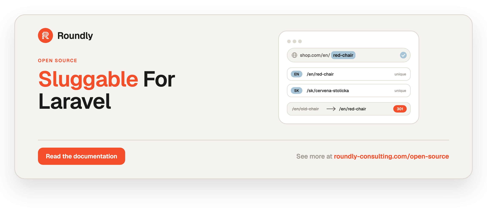

<!-- roundly-hero:start -->
<p align="center">
  <a href="https://roundly-consulting.com/open-source/docs/sluggable-for-laravel?utm_source=github&utm_medium=readme&utm_campaign=open-source&utm_content=sluggable-for-laravel">
    
  </a>
</p>
<!-- roundly-hero:end -->

<!-- roundly-badges:start -->
<p align="center">
  <a href="https://packagist.org/packages/roundly-consulting/sluggable-for-laravel"></a>
  <a href="https://github.com/roundly-consulting/sluggable-for-laravel/actions/workflows/run-tests.yml"></a>
  <a href="https://github.com/roundly-consulting/sluggable-for-laravel/actions/workflows/fix-php-code-style-issues.yml"></a>
  <a href="https://donate.stripe.com/dRmeVe8FX5PF1Qd9pXcEw00"></a>
  <a href="https://www.patreon.com/cw/roundly"></a>
  <a href="https://roundly-consulting.com/support-us?utm_source=github&utm_medium=readme&utm_campaign=open-source&utm_content=sluggable-for-laravel#crypto"></a>
</p>
<!-- roundly-badges:end -->

# Sluggable for Laravel

Single- and multi-language slugs for Eloquent: plain `string` slug columns and `json`/`jsonb`
**locale-map** slug columns (`{"en": "red-chair", "sk": "cervena-stolicka"}`), any number of slug
columns per model, scoped per-locale uniqueness backed by engine-native unique indexes,
locale-aware route model binding, validation rules, Artisan tooling and an optional SEO slug
history with automatic 301 redirects. Native Laravel only — zero third-party runtime dependencies.

With the default options every generated slug **matches `Str::slug()` for ordinary input of up to
255 characters**, so adopting the package keeps the slugs you already have. Two deliberate
differences: zero-width and bidi control characters are stripped before transliterating
(`"zero\u{200B}width"` gives `zerowidth`, where `Str::slug()` gives `zero-width`), and slugs are
capped at `max_length` (255) from the first `max_source_length` (2000) source characters, where
`Str::slug()` has no limit.

## Requirements

- PHP 8.4+
- Laravel 12.x or 13.x
- For the unique-index DDL (`SlugIndexes`, `sluggable:indexes`): PostgreSQL 12+, MySQL 8.0.23+ /
  MariaDB 10.3.3+, or SQLite 3.38+. Generation and querying work on every Laravel driver.

## Installation

```bash
composer require roundly-consulting/sluggable-for-laravel
```

Optionally publish the config file and translations:

```bash
php artisan vendor:publish --tag="sluggable-config"
php artisan vendor:publish --tag="sluggable-translations"
```

Only if you use slug history (redirects from old URLs), publish and run the migration:

```bash
php artisan vendor:publish --tag="sluggable-migrations"
php artisan migrate
```

## Configuration

Every key has a working default; the package needs zero host configuration.

```php
return [
    'defaults' => [
        'column' => 'slug',
        'source' => 'name',
        'separator' => '-',
        'max_length' => 255,
        'max_words' => null,
        'language' => env('SLUGGABLE_LANGUAGE', 'en'),
        'dictionary' => ['@' => 'at'],
        'lowercase' => true,
        'unicode' => false,
        'uniqueness' => 'global',
        'locale_uniqueness' => 'per_locale',
        'include_trashed' => true,
        'on_create' => true,
        'on_update' => env('SLUGGABLE_ON_UPDATE', 'if_empty'),
        'manual' => 'normalize',
        'empty_source' => 'random',
        'suffix' => 'sequential',
        'suffix_start' => 2,
        'random_length' => 8,
        'target_locales' => 'source',
        'locale_fallback' => 'any',
    ],
    'reserved' => [],
    'locales' => [
        'supported' => null,
        'fallback' => env('SLUGGABLE_FALLBACK_LOCALE'),
    ],
    'binding' => [
        'key_fallback' => false,
    ],
    'limits' => [
        'max_source_length' => 2000,
        'sequential_probes' => 50,
        'probe_batch' => 10,
        'random_attempts' => 10,
    ],
    'concurrency' => [
        'retries' => env('SLUGGABLE_RETRIES', 3),
    ],
    'history' => [
        'enabled' => env('SLUGGABLE_HISTORY', false),
        'redirect' => env('SLUGGABLE_HISTORY_REDIRECT', true),
        'redirect_status' => 301,
        'avoid_reuse' => false,
        'table' => env('SLUGGABLE_HISTORY_TABLE', 'slug_history'),
        'model' => \RoundlyConsulting\Sluggable\Models\SlugHistory::class,
        'prune_after_days' => env('SLUGGABLE_HISTORY_PRUNE_DAYS'),
    ],
    'key_type' => env('SLUGGABLE_KEY_TYPE', 'bigint'),
];
```

| Key | Default | Env | Meaning |
|---|---|---|---|
| `defaults.column` | `slug` | — | column of the zero-config definition |
| `defaults.source` | `name` | — | source attribute of the zero-config definition |
| `defaults.separator` | `-` | — | 1–3 chars from `-` `.` `_` `~` |
| `defaults.max_length` | `255` | — | characters incl. prefix/suffix and collision suffix (8–2048) |
| `defaults.max_words` | `null` | — | word cap (`null` or blank = none) |
| `defaults.language` | `en` | `SLUGGABLE_LANGUAGE` | transliteration language of **string** slugs (locale maps use each locale) |
| `defaults.dictionary` | `['@' => 'at']` | — | replacements applied before stripping |
| `defaults.lowercase` | `true` | — | lowercase the slug |
| `defaults.unicode` | `false` | — | keep non-ASCII letters instead of transliterating |
| `defaults.uniqueness` | `global` | — | `none` / `global` / `scoped` |
| `defaults.locale_uniqueness` | `per_locale` | — | `per_locale` / `across_locales` |
| `defaults.include_trashed` | `true` | — | soft-deleted rows keep their slug reserved |
| `defaults.on_create` | `true` | — | generate on create |
| `defaults.on_update` | `if_empty` | `SLUGGABLE_ON_UPDATE` | `never` / `if_empty` / `when_source_changes` / `always` |
| `defaults.manual` | `normalize` | — | `normalize` / `verbatim` / `strict` |
| `defaults.empty_source` | `random` | — | `random` / `skip` / `fail` |
| `defaults.suffix` | `sequential` | — | `sequential` / `random` (`custom` needs `suffixUsing()`) |
| `defaults.suffix_start` | `2` | — | first sequential suffix (1–1000) |
| `defaults.random_length` | `8` | — | random slug / random suffix length (4–32) |
| `defaults.target_locales` | `source` | — | `source` / `supported` / `current` |
| `defaults.locale_fallback` | `any` | — | `none` / `fallback` / `any` — reading and binding chain |
| `reserved` | `[]` | — | slugs nobody may take (case-insensitive) |
| `locales.supported` | `null` | — | locale list; `null` = `app.locale` + `app.fallback_locale` |
| `locales.fallback` | `null` | `SLUGGABLE_FALLBACK_LOCALE` | `null` or blank = `app.fallback_locale` |
| `binding.key_fallback` | `false` | — | try the primary key after a slug miss |
| `limits.max_source_length` | `2000` | — | source characters considered |
| `limits.sequential_probes` | `50` | — | sequential candidates before random ones |
| `limits.probe_batch` | `10` | — | candidates checked per query |
| `limits.random_attempts` | `10` | — | random candidates before giving up |
| `concurrency.retries` | `3` | `SLUGGABLE_RETRIES` | retries after a unique-index race (0–20; 0 disables) |
| `history.enabled` | `false` | `SLUGGABLE_HISTORY` | default for `keepHistory()` |
| `history.redirect` | `true` | `SLUGGABLE_HISTORY_REDIRECT` | default for `redirectFromHistory()` |
| `history.redirect_status` | `301` | — | 301 / 302 / 307 / 308 |
| `history.avoid_reuse` | `false` | — | default for `avoidHistoricalSlugs()` |
| `history.table` | `slug_history` | `SLUGGABLE_HISTORY_TABLE` | history table |
| `history.model` | `SlugHistory::class` | — | swappable history model (must extend it) |
| `history.prune_after_days` | `null` | `SLUGGABLE_HISTORY_PRUNE_DAYS` | prune age; `null` or blank (`SLUGGABLE_HISTORY_PRUNE_DAYS=`) keeps forever |
| `key_type` | `bigint` | `SLUGGABLE_KEY_TYPE` | primary-key type of the slugged models (`bigint`/`uuid`/`ulid`) |

Every key is validated: a typo (say `SLUGGABLE_HISTORY=disabled`) throws
`InvalidSlugDefinitionException` naming the key instead of silently falling back. Switches accept
`true`/`false`, `1`/`0`, `on`/`off` and `yes`/`no`; string keys (`column`, `source`, `separator`,
`language`, `history.table`, `locales.fallback`) must be strings; `reserved` and
`locales.supported` must be lists of non-empty strings and `dictionary` a string => string map, a
bad entry throwing rather than being dropped. Only a key that is not set — absent, `null` or blank
(a host's `KEY=`) — takes its default. An unrecognized `key_type` throws the toolkit's
`InvalidConfigurationException`.

## Usage

### Quick start

```php
use Illuminate\Database\Eloquent\Model;
use RoundlyConsulting\Sluggable\Concerns\HasSlug;
use RoundlyConsulting\Sluggable\Contracts\Sluggable;

final class Clinic extends Model implements Sluggable
{
    use HasSlug;   // zero config: `slug` generated from `name`

    protected $fillable = ['name', 'slug'];
}

Clinic::create(['name' => 'Happy Paws'])->slug;   // "happy-paws"
Clinic::create(['name' => 'Happy Paws'])->slug;   // "happy-paws-2"
```

```php
$table->slug();                  // string('slug', 255)
$table->uniqueSlug();            // unique index named clinics_slug_slug_unique
```

### The `Slugs` facade

One entry point for everything that is not a model hook: flat verbs for one model, and
`Slugs::model(Post::class)` for class-wide work.

```php
use RoundlyConsulting\Sluggable\Enums\RegenerationMode;
use RoundlyConsulting\Sluggable\Facades\Slugs;

// Text and one model
Slugs::slugify('Žltý kôň @ home', language: 'sk');     // 'zlty-kon-at-home'
Slugs::generate($product, column: 'slug');              // the value it would get; sets nothing
Slugs::apply($product);                                 // run the save-time pass now (before saveQuietly/imports)
Slugs::recompute($product, columns: ['slug']);          // recompute from the sources; you save
Slugs::regenerate($product, columns: ['slug']);         // recompute + save
Slugs::withoutGeneration(fn () => $importer->run());    // nestable, exception-safe toggles
Slugs::unlocked(fn () => $product->update(['slug' => 'new']));
Slugs::locales();                                       // SlugLocales

// A whole model class (a class name or its morph alias)
$products = Slugs::model(Product::class);
$products->regenerate(mode: RegenerationMode::Stale, dryRun: true);   // RegenerationReport
$products->regenerate(mode: RegenerationMode::Missing, withHistory: true, columns: ['slug']);
$products->queueRegeneration(mode: RegenerationMode::All, chunk: 1000); // jobs dispatched (int)
$products->duplicates(column: 'slug', locale: 'sk');   // list<SlugDuplicate> a unique index would reject
$products->indexes(dryRun: true);                      // SlugIndexReport: the DDL, nothing executed
$products->indexes();                                  // create the missing engine-native indexes
$products->findInHistory('old-name', locale: 'sk');    // the row that retired a slug, or null
$products->findInHistory('old-name', within: Product::query()->where('shop_id', $shop->id));
$products->options();                                  // ResolvedSlugOptions
```

- `regenerate()` / `queueRegeneration()` take `mode`, `withHistory`, `columns`, `locales`,
  `chunk`, `withoutEvents` and `force` (bypass locks) — the same options as
  `sluggable:regenerate`; `regenerate()` also takes `dryRun`. Rows are scanned without global
  scopes; each changed row is saved normally.
- `findInHistory()` resolves through the model's default query (global scopes applied) or the
  query you pass as `within` — a retired slug never reveals a row that query would not return.
- `$model->regenerateSlugs()` is `Slugs::recompute($model)` from the model side.

#### Without the facade

The facade is sugar over `SlugManager`; inject it, or call the action behind a method directly.

```php
use RoundlyConsulting\Sluggable\Actions\RegenerateSlugsAction;
use RoundlyConsulting\Sluggable\DataTransferObjects\RegenerateSlugsData;
use RoundlyConsulting\Sluggable\Enums\RegenerationMode;
use RoundlyConsulting\Sluggable\SlugManager;

final class BackfillSlugs
{
    public function __construct(private SlugManager $slugs) {}

    public function __invoke(): void
    {
        $this->slugs->model(Product::class)->regenerate(mode: RegenerationMode::Missing);
    }
}

app(RegenerateSlugsAction::class)->execute(new RegenerateSlugsData(Product::class, mode: RegenerationMode::Stale));
```

| Method | Action |
|---|---|
| `apply()`, `recompute()`, `regenerate()` | `GenerateSlugsAction` |
| `model()->regenerate()` | `RegenerateSlugsAction` |
| `model()->queueRegeneration()` | `QueueSlugRegenerationAction` (dispatches `RegenerateSlugsJob`) |
| `model()->duplicates()` | `FindDuplicateSlugsAction` |
| `model()->findInHistory()` | `ResolveSlugFromHistoryAction` |
| `model()->indexes()` | `SlugIndexes::forModel()` (schema helper, also usable in migrations) |

#### Testing your code

There is no `Slugs::fake()`: generation is deterministic and runs against your own database, so
assert on the saved rows. Around `queueRegeneration()` use `Bus::fake()` and
`Bus::assertDispatched(RegenerateSlugsJob::class)`.

### Multiple columns

```php
use RoundlyConsulting\Sluggable\Definitions\SlugDefinition;
use RoundlyConsulting\Sluggable\Definitions\SlugOptions;
use RoundlyConsulting\Sluggable\Enums\UpdatePolicy;

public function slugOptions(): SlugOptions
{
    return SlugOptions::make(
        SlugDefinition::for('slug')
            ->from('name')
            ->uniqueWithin('clinic_id')
            ->onUpdate(UpdatePolicy::WhenSourceChanges)
            ->keepHistory()
            ->routeKey(),
        SlugDefinition::for('handle')
            ->from(['brand.name', 'name'])       // relation dot path + attribute
            ->separator('_')
            ->maxLength(40)
            ->immutable(),
        SlugDefinition::for('code')
            ->from(fn (Product $product, ?string $locale): string => $product->sku)
            ->lowercase(false)
            ->notUnique(),
    );
}
```

Definitions run in declaration order, so a later column may use an earlier slug as its source.

Every `SlugDefinition` option (unset = the config default):

| Method | Meaning |
|---|---|
| `for(string $column)` | the slug column |
| `from(string\|list<string>\|Closure)` | attribute(s), dot paths through relations (loaded with `loadMissing`), or `fn (Model $m, ?string $locale): ?string` |
| `sourceLocale(string)` | which locale of a locale-map source feeds a **string** slug (default: fallback → current → first) |
| `separator(string)`, `maxLength(int)`, `maxWords(?int)` | formatting |
| `language(string\|Closure\|null)`, `dictionary(array)`, `unicode()`, `lowercase(bool)` | transliteration / characters |
| `using(Closure $slugger)` | replace the formatting steps; the output is still validated as a safe URL segment |
| `reserved(list<string>)` | extra reserved words |
| `prefix(string\|Closure)`, `suffix(string\|Closure)` | affixes, never cut by truncation |
| `unique()`, `uniqueWithin(string ...$columns)`, `uniqueWhere(Closure)`, `notUnique()` | uniqueness |
| `perLocaleUniqueness()`, `uniqueAcrossLocales()` | locale maps only |
| `includeTrashed(bool)`, `excludeTrashed()` | whether soft-deleted rows count as taken |
| `sequentialSuffix(int $start = 2)`, `randomSuffix(?int $length)`, `suffixUsing(SuffixGenerator\|Closure)` | collision strategy |
| `randomLength(int)` | random slug / suffix length (4–32) |
| `onCreate(bool)`, `onUpdate(UpdatePolicy)`, `immutable()`, `regenerateOnUpdate()` | lifecycle |
| `manual(ManualSlugPolicy)` | how host-supplied values are treated |
| `whenEmptySource(EmptySourcePolicy)` | empty source → random / skip / fail |
| `lockWhen(Closure)`, `locked()` | freeze a slug (e.g. once published) |
| `skipWhen(Closure)` | skip the column for a save |
| `localized(bool)`, `storage(SlugStorage)` | force the storage (default: auto-detected) |
| `locales(TargetLocales\|list<string>\|Closure)` | which locales get generated |
| `fallback(LocaleFallback)`, `fallbackLocale(string\|Closure\|null)` | reading/binding chain and its fallback locale |
| `routeKey(bool)` | this column becomes `getRouteKeyName()` (max. one) |
| `bindByKeyFallback(bool)` | try the primary key after a slug miss |
| `keepHistory(bool)`, `redirectFromHistory(bool)`, `avoidHistoricalSlugs(bool)` | slug history |
| `retries(int)` | race retries (0 disables) |

Closure setters are generic, so `->lockWhen(fn (Post $post): bool => $post->is_published)` passes
Larastan level 7 in your code.

### The attribute form

For the closure-free subset:

```php
use RoundlyConsulting\Sluggable\Attributes\Slug;

#[Slug('slug', from: 'name', uniqueWithin: ['kind_id'], routeKey: true)]
#[Slug('short', from: ['kind.name', 'name'], maxLength: 40, onUpdate: UpdatePolicy::Never)]
final class Breed extends Model implements Sluggable
{
    use HasSlug;
}
```

An overridden `slugOptions()` wins over attributes (declaring both throws in `local`/`testing`).

### Locale maps (multi-language slugs)

A slug column is a locale map when the model implements `ProvidesLocaleMaps` for it (what
`translatable-for-laravel`'s `Translatable` contract does), when the column has an `array`/`json`/
`object`/`collection` cast, or when you call `->localized()`:

```php
// config/sluggable.php — the locales your site serves (default: app.locale + app.fallback_locale)
'locales' => ['supported' => ['en', 'sk', 'de']],
```

```php
final class Topic extends Model implements Sluggable
{
    use HasSlug;

    protected $fillable = ['name', 'slug'];

    protected $casts = ['name' => 'array', 'slug' => 'array'];
}

$topic = Topic::create(['name' => ['en' => 'Investing', 'sk' => 'Investovanie', 'de' => 'Straße']]);
$topic->slug;   // ['en' => 'investing', 'sk' => 'investovanie', 'de' => 'strasse']
```

- Each locale is transliterated in its own language (`de`: `ß` → `ss`).
- Locale-map **sources** are read raw, never through `getAttribute()` (translation traits return
  the current-locale string there), so the `sk` slug is always built from the `sk` name.
- Slugs are generated only in locales a lookup can find — the current and fallback locale,
  `SlugLocales::supported()` and an explicit `locales([...])` list — so every slug, and every
  route key, resolves. `TargetLocales::Source` (default) generates the source locales among them
  (a source written only in other locales still gets a slug, in the current locale); `Supported`
  generates every supported locale (missing sources fall back); `Current` only the request locale;
  or pass a list (searched like `supported`) or a closure (limited to that set).
- Blank and JSON-`null` values are ignored; locales sluggable does not generate are preserved.
- A model that exposes `isLocaleMapAttribute()` (e.g. uses `HasTranslations`) but does **not**
  implement `ProvidesLocaleMaps` is rejected (`localeMapContractMissing`) rather than silently
  treated as a string column.
- Locales come from the `SlugLocales` contract: sluggable binds a config-driven default with
  `bindIf()`; translatable-for-laravel rebinds it to its own locale source; your own binding wins.

```php
$topic->currentSlug();      // current locale, then the chain (fallback, then every resolvable locale)
$topic->slugFor('sk');      // exact locale, no fallback
$topic->slugMap();          // ['en' => …, 'sk' => …]  (string column: ['*' => …])
```

### Update, manual and lock policies

| Situation | Behaviour |
|---|---|
| create, empty value | generate from the sources; empty source → `EmptySourcePolicy` (`Random` default) |
| manual value (create or change) | `Normalize` (default): run the pipeline, then make unique (a value normalising to nothing counts as empty: generated, or cleared) · `Verbatim`: keep the bytes, make unique · `Strict`: keep the bytes, throw `SlugAlreadyTakenException` if taken |
| update, `Never` | nothing, even when empty |
| update, `IfEmpty` (default) | fill an empty value / missing locales; never touch existing ones |
| update, `WhenSourceChanges` | recompute when a source attribute changed (per locale for maps) |
| update, `Always` | recompute every update |
| `lockWhen()` true / `locked()` | no automatic change; a manual change throws `SlugLockedException` (bypass: `Slugs::unlocked(fn () => …)`) |
| scope column changed / restore with `excludeTrashed()` | re-check uniqueness; re-suffix (or throw for `Strict`) |

A recomputed slug replaces the current one only when its base changed: `chair-2` never churns into
`chair-3`. The base is the one the saved sources produce, not the slug's shape — renaming
`Room 101` to `Room` gives `room` (or `room-2`), never the stale `room-101`. An explicit recompute
(`recompute()`, `regenerateSlugs()`, `--mode=stale`) also drops a suffix whose bare base is free
again. Verbatim/strict values containing whitespace, control characters, `/`, `?`, `#` or `%`,
and the dot segments `.` / `..`, are rejected.

```php
use RoundlyConsulting\Sluggable\Facades\Slugs;

Slugs::withoutGeneration(fn () => Product::factory()->count(500)->create());  // imports
Slugs::unlocked(fn () => $post->update(['slug' => 'fixed-typo']));
Product::withoutSlugGeneration(fn () => /* … */ null);
```

### Uniqueness and scopes

- Collisions are checked **without global scopes** — a tenancy, `published` or SoftDeletes scope
  never hides a taken slug — then with the definition's scope columns / closure, trashed rule and
  the model's own key excluded. `NULL` is a scope value to the check.
- Probing is bounded and batched: the base, then sequential candidates in batches of 10 (≤ 6
  queries for 50), then 10 random suffixes, then `SlugGenerationException::exhausted()`.
- Reserved words (config + `reserved()`) count as taken.
- `uniqueAcrossLocales()` and `uniqueWhere()` closures are enforced by the application only.

### Schema and engine-native indexes

```php
$table->slug('slug');                                // string(255)
$table->localizedSlug('slug');                       // jsonb (pgsql) / json (mysql) / text (sqlite)
$table->uniqueSlug('slug', scope: ['clinic_id']);    // string slug, trashed rows count as taken

use RoundlyConsulting\Sluggable\DataTransferObjects\SlugIndexSpec;
use RoundlyConsulting\Sluggable\Schema\SlugIndexes;

// after Schema::create(…):
SlugIndexes::ensure(SlugIndexSpec::localeMap('topics', 'slug', scope: ['shop_id']));
SlugIndexes::ensure(SlugIndexSpec::string('articles', 'slug', includeTrashed: false));
SlugIndexes::forModel(Topic::class);       // specs derived from the definitions (= Slugs::model(Topic::class)->indexes())
SlugIndexes::plan($spec);                  // DDL only
```

| Engine | Locale map | Exclude-trashed string |
|---|---|---|
| PostgreSQL | `CREATE UNIQUE INDEX … (("slug"->>'en'))` per locale, partial `WHERE deleted_at IS NULL` when needed | partial unique index |
| SQLite | `CREATE UNIQUE INDEX … (json_extract("slug", '$."en"'))`, partial when needed | partial unique index |
| MySQL / MariaDB | an INVISIBLE virtual column `slug__en` (`utf8mb4_bin`, `NULL` for missing/JSON null/trashed) + a unique index | INVISIBLE `slug__live` with the source collation + unique index |

- Indexes are idempotent and named `{table}_{column}[_{locale}]_slug_unique`.
- Locales come from `SlugLocales::supported()` at migrate time; add a locale later with
  `php artisan sluggable:indexes "App\Models\Topic"`. Removed locales keep their index.
- `includeTrashed` on a spec defaults to `true` — mirror the definition, or use `forModel()`.
- MySQL: locale-map indexes are binary (`Café` and `cafe` are different slugs, like the app-level
  check); string slug columns keep your collation (case/accent-insensitive by default). MySQL
  lookups are not accelerated by the generated columns — they enforce uniqueness only.
- SQL Server: generation and querying work; the index DDL throws `UnsupportedDriverException`.

### Concurrency

Two writers can pick the same free slug. The unique index rejects the loser; sluggable catches
the `UniqueConstraintViolationException`, re-probes with a locking read, re-suffixes and retries
(`retries`, default 3). Inside an outer transaction each attempt runs in a SAVEPOINT, so the
transaction stays usable on Postgres. A violation that names no slug index is rethrown untouched;
one where the re-probe finds nothing taken throws `SlugGenerationException::constraintMismatch()`
(your index disagrees with the definition — run `sluggable:indexes --dry-run`).

Only sluggable's own values are re-suffixed. Inside `Slugs::withoutGeneration()` the retry is off
too: a duplicate slug you write yourself fails with the database's
`UniqueConstraintViolationException`. Under `ManualSlugPolicy::Strict`, a value no generation pass
produced in this save (a manual value, or one saved with `saveQuietly()` without `Slugs::apply()`)
throws `SlugAlreadyTakenException` instead of being rewritten.

### Querying

```php
Product::whereSlug('red-chair')->first();                   // default column
Product::whereSlug('rc-01', column: 'handle')->first();
Topic::whereSlug('investovanie', locale: 'sk')->first();     // exact locale
Topic::whereSlug('investing')->first();                     // chain: current → fallback → supported
Topic::whereSlugIn(['a', 'b'])->get();
Topic::whereSlugInAnyLocale('investing')->first();          // current, fallback, supported, listed
Topic::whereSlug('gift')->orderBySlugPreference('gift')->first();
Product::findBySlug('red-chair');                            // ?Product (adds the preference order)
Product::findBySlugOrFail('red-chair');                      // ModelNotFoundException → 404
```

Scopes add **predicates only**, so `->count()`, `->paginate()` and `whereHas()` sub-queries work
on every engine; only finders and route binding add the locale-preference `ORDER BY`. Packages with
a swappable model should call scopes through their seam (`PostModel::query()->whereSlug(…)`), not
`Post::findBySlug(…)` (late static binding ignores the swap).

### Routing

```php
Route::get('/topics/{topic}', ShowTopic::class);                              // routeKey() column
Route::get('/posts/{post:seo_slug}', ShowPost::class);                        // any slug column
Route::get('/clinics/{clinic}/products/{product:slug}', ShowProduct::class)->scopeBindings();
Route::get('/archive/{topic}', ShowArchived::class)->withTrashed();
route('topics.show', $topic);                                                 // current-locale slug
```

- `routeKey()` makes the column `getRouteKeyName()`; for a locale map `getRouteKey()` is the
  current-locale slug (URL generation depends on the locale — queued URL generation should run
  under the intended locale).
- Binding follows the definition's chain (`LocaleFallback::Any` by default: a URL in any
  resolvable locale still resolves) and prefers the current locale.
- `bindByKeyFallback()` tries the primary key **after** a slug miss, and only for values shaped
  like the key (`ctype_digit` for integer keys, the model's own uuid/ulid validation for unique
  ids) — a numeric slug like `2024` is never shadowed by id 2024.
- Non-string, over-long or control-character values never reach the database.

### Slug history and redirects

```php
SlugDefinition::for('slug')->from('name')->regenerateOnUpdate()->keepHistory()->routeKey();
```

- Every persisted change retires the previous value into `slug_history` (publish the migration).
  A model taking back one of its own old slugs removes that entry.
- A GET/HEAD request with a retired slug renders a **301** (`history.redirect_status`) to the same
  route with the current slug, keeping the query string. The target is resolved through the
  route's own query (global scopes, the parent of a scoped binding, trashed handling), so drafts,
  other tenants' rows and trashed rows are never revealed. Other methods get a 404.
- `SlugMovedException` implements `ShouldntReport`; it never reaches your error log.
- `avoidHistoricalSlugs()` keeps other models from taking a retired slug.
- History rows are removed when the model is really deleted (no SoftDeletes, or force delete).
  Mass deletes that fire no model events leave inert orphan rows — pruning ages them out.
- Pruning: set `history.prune_after_days` and schedule
  `Schedule::command('model:prune', ['--model' => [\RoundlyConsulting\Sluggable\Models\SlugHistory::class]]);`
  (or your configured `history.model`).
- The history morph id column follows `sluggable.key_type`; a model whose key type does not fit
  is rejected at definition time (`historyKeyTypeMismatch`). One key type per host.
- History stores slugs of up to 255 characters; a history-keeping definition with a larger
  `maxLength` is rejected at definition time.
- `Slugs::model(Product::class)->findInHistory('old-name', column: 'slug', locale: 'sk')`.

### Validation

```php
use RoundlyConsulting\Sluggable\Rules\UniqueSlug;
use RoundlyConsulting\Sluggable\Rules\ValidSlug;
use Illuminate\Validation\Rule;

'slug' => ['nullable', 'string', ValidSlug::for(Product::class),
           UniqueSlug::for(Product::class)->ignore($product)->where('clinic_id', $clinicId)],
'slug' => ['nullable', 'array', UniqueSlug::for(Topic::class)->ignore($topic)],   // every locale
'slug' => [Rule::uniqueSlug(Topic::class, 'slug')->locale('sk')],
```

- `UniqueSlug` uses exactly the generation semantics (scopes, trashed rows, no global scopes,
  reserved words) and compares the normalised value under the `Normalize` policy.
- Scope values are **never read from the request implicitly** (that would be a cross-tenant
  "is this slug taken?" oracle). Per scope column: `where()`, then the `within()`/`ignore($model)`
  model's attribute, then — only for columns named in `scopeFromInput('clinic_id')` — the
  validated data; otherwise the rule throws `missingScopeValue`.
- Locale-map input: a string means the current (or `locale()`) locale; unsupported locales are
  ignored; errors land on `slug.{locale}`.
- `ValidSlug` passes when the value equals its own normalisation, fits `maxLength` and is not
  reserved (`new ValidSlug(separator: '-', maxLength: 255, unicode: false, lowercase: true, reserved: [])`).
- Messages: `sluggable::validation.{unique,unique_locale,format,too_long,reserved,locked}`.

### Events

| Event | Payload | When |
|---|---|---|
| `SlugChanged` (after commit) | `model`, `column`, `locale`, `previous`, `current`, `reason` (`ChangeReason`) | once per persisted change |
| `SlugCollisionRetried` | `modelClass`, `column`, `attempt` | every race retry |
| `SlugsRegenerated` | `modelClass`, `report` | end of a regeneration run / queued chunk |

### Commands

```bash
php artisan sluggable:regenerate "App\Models\Product"                          # backfill empty slugs
php artisan sluggable:regenerate "App\Models\Topic" --locale=de                # backfill a new locale
php artisan sluggable:regenerate "App\Models\Product" --mode=stale --history --dry-run
php artisan sluggable:regenerate "App\Models\Product" --mode=all --force --chunk=1000 --queue
php artisan sluggable:indexes "App\Models\Topic" [--column=slug] [--dry-run]
php artisan sluggable:duplicates "App\Models\Product" [--column=slug] [--locale=sk]
```

- `sluggable:regenerate {model} {--column=*} {--locale=*} {--mode=missing|stale|all} {--chunk=500}
  {--dry-run} {--history} {--without-events} {--queue} {--force}` — rows are scanned without
  global scopes; locks are respected unless `--force`; `--mode=all` asks for confirmation unless
  `--force`; `--queue` dispatches one `RegenerateSlugsJob` per chunk.
- `sluggable:duplicates` lists values a unique index would reject (and over-long values; a
  `notUnique()` column gets no index, so only its over-long values are listed) — run it
  before adding an index to existing data. It reports; it never changes data.
- `{model}` accepts a class name or a morph alias.
- Each command is also on the facade: `Slugs::model(X::class)->regenerate()` /
  `->queueRegeneration()` / `->indexes()` / `->duplicates()`.

### Composing with other traits

`HasSlug` overrides `performInsert`, `performUpdate`, `getRouteKeyName`, `getRouteKey`,
`resolveRouteBindingQuery`, `resolveRouteBinding`, `resolveSoftDeletableRouteBinding` and
`resolveChildRouteBinding`.

- A trait overriding the same methods needs `insteadof`. `HasUuids`/`HasUlids` define
  `resolveRouteBindingQuery`:

  ```php
  use HasSlug, HasUuids {
      HasSlug::resolveRouteBindingQuery insteadof HasUuids;
  }
  ```

  `HasSlug` keeps their malformed-id guard for key bindings.
- A method declared on the model class itself silently wins over the trait — delete your own
  `getRouteKeyName()` / `resolveRouteBinding()` when adopting `routeKey()`.
- Helpers are prefixed `sluggable…`; `HasSlug` declares none of `currentLocale`, `fallbackLocale`,
  `readMap`, `writeMap`, `getTranslation(s)`, `setTranslation(s)` …, so it composes with the
  common translation traits without `insteadof`.
- Hooks run in `creating`/`updating` (not `saving`), after trait listeners declared earlier —
  declare a trait that sets a scope column (e.g. a tenant id) **before** `HasSlug`.

### Adopting in an existing app

| Typical option elsewhere | sluggable |
|---|---|
| generate from `name` into `slug` | zero config, or `#[Slug('slug', from: 'name')]` |
| regenerate on update | `->onUpdate(UpdatePolicy::WhenSourceChanges)` (or keep `IfEmpty` + `->keepHistory()`) |
| suffix starts at `-1` | `->sequentialSuffix(start: 1)` |
| global uniqueness vs a scoped DB index | `->uniqueWithin('clinic_id')` |
| manual `getRouteKeyName()` | `->routeKey()` |
| "don't regenerate on update" / "prevent overwrite" | `->immutable()` / `ManualSlugPolicy` |

Run `php artisan sluggable:duplicates` before switching on a unique index.

### Limitations

- Query-builder `insert()`/`upsert()`, `saveQuietly()` and `withoutEvents()` fire no model events
  and so generate nothing — call `Slugs::apply($model)` first.
- A no-op `save()` does not back-fill (Laravel fires `updating` only for dirty models) — use
  `regenerateSlugs()`, `Slugs::model(X::class)->regenerate()` or `sluggable:regenerate --mode=missing`.
- A race retry re-fires `creating`/`updating` for your listeners too; use `retries(0)` for models
  with non-idempotent listeners.
- Across-locales and closure-scoped uniqueness are application-level only.
- One history `key_type` per host.

## Testing

```bash
composer test
composer test-coverage
composer analyse
```

## Changelog

See [CHANGELOG.md](CHANGELOG.md).

## Contributing

Pull requests are welcome; run Pint, Larastan (level 7) and the Pest suite before submitting.

<!-- roundly-support:start -->
## Support our work

This package is free and open source, built and maintained by
[Roundly Consulting](https://roundly-consulting.com/open-source?utm_source=github&utm_medium=readme&utm_campaign=open-source&utm_content=sluggable-for-laravel).
If it saves you time, please consider supporting our open-source work — a one-time donation, a
monthly pledge on Patreon or a crypto donation helps fund maintenance, new features and new
packages.

<a href="https://donate.stripe.com/dRmeVe8FX5PF1Qd9pXcEw00"></a>
<a href="https://www.patreon.com/cw/roundly"></a>
<a href="https://roundly-consulting.com/support-us?utm_source=github&utm_medium=readme&utm_campaign=open-source&utm_content=sluggable-for-laravel#crypto"></a>
<!-- roundly-support:end -->

## License

The MIT License (MIT). See [LICENSE.md](LICENSE.md).
